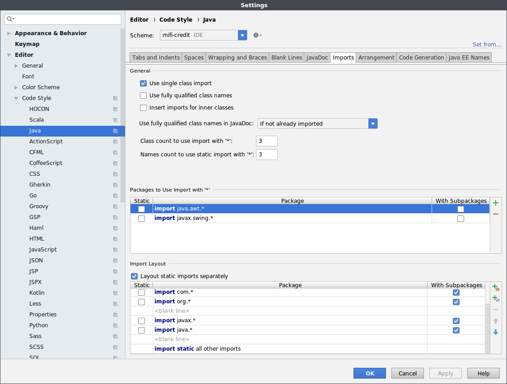

# 代码风格设定

代码风格设定可能是最为基础的一个工作，当新融入一个团体，配置好环境之后必须要做的就是配置代码风格和团队保持一致。

如果熟悉的话应该都会知道 [Google Java Style Guide](https://google.github.io/styleguide/javaguide.html)

Google 提供了 IntelliJ 中的风格配置

- <https://github.com/google/styleguide/blob/gh-pages/intellij-java-google-style.xml>

导入该样式即可。

不同团队可能对缩进和 import 语句顺序有些许调整，那也比较简单，在

    File -> Settings -> Editor -> Code Style -> Java

中进行设置即可。

如果要调整 import 语句的顺序，在下方 Import Layout 中可以自定义导入的顺序。