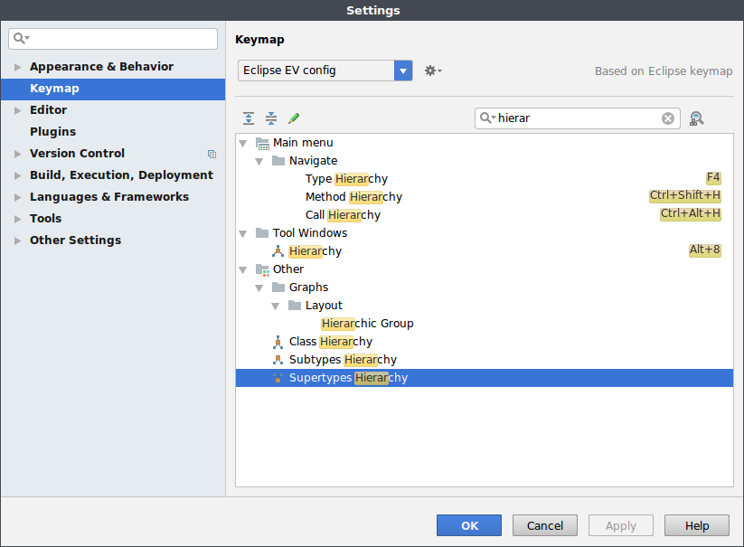

# 在 IntelliJ IDEA 中查看一个类的所有继承类

在每一个类文件中右击都有一个 `Diagrams` 的选项，在该选项下有两个选择，选择其中一个即可查看当前类的继承关系图。

或者将鼠标放到类名上，然后使用快捷键 `Ctrl` + `T` 来弹出实现类的窗口。不同操作系统的快捷键可能不一致，在 Settings 中 Keymap，可以搜索 `implementation` 查看当前快捷键什么。

如果要查看层级 hierarchy 窗口，在 IntelliJ 中使用 `F4`

通过这个技巧就能够查看这个类的家族图谱，兄弟姐妹都非常清晰了。