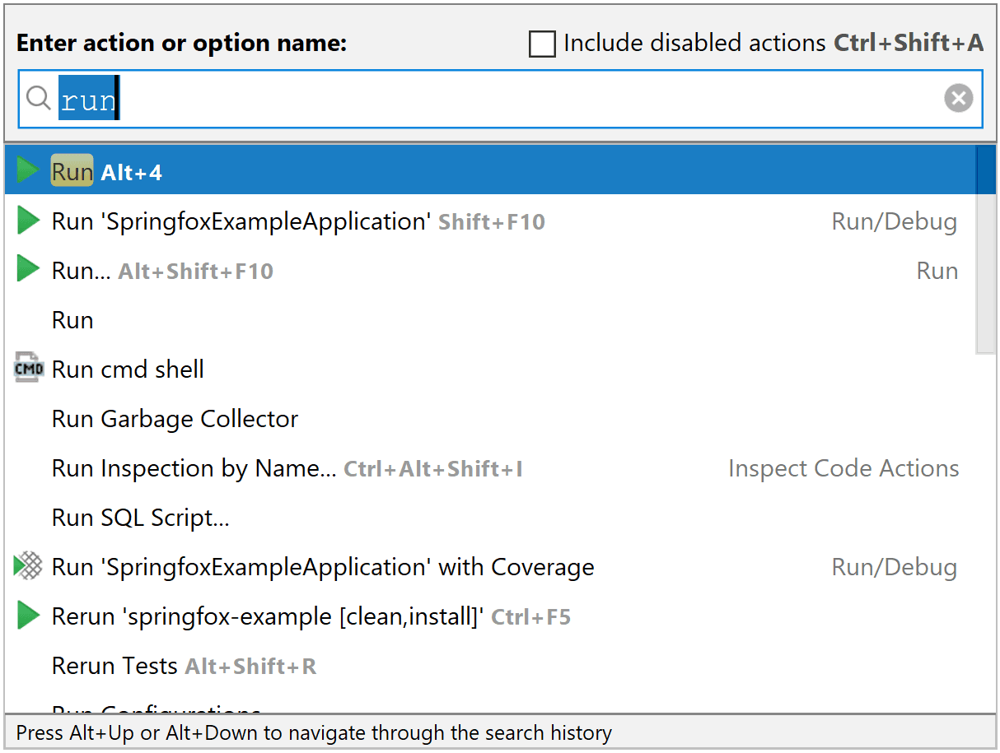
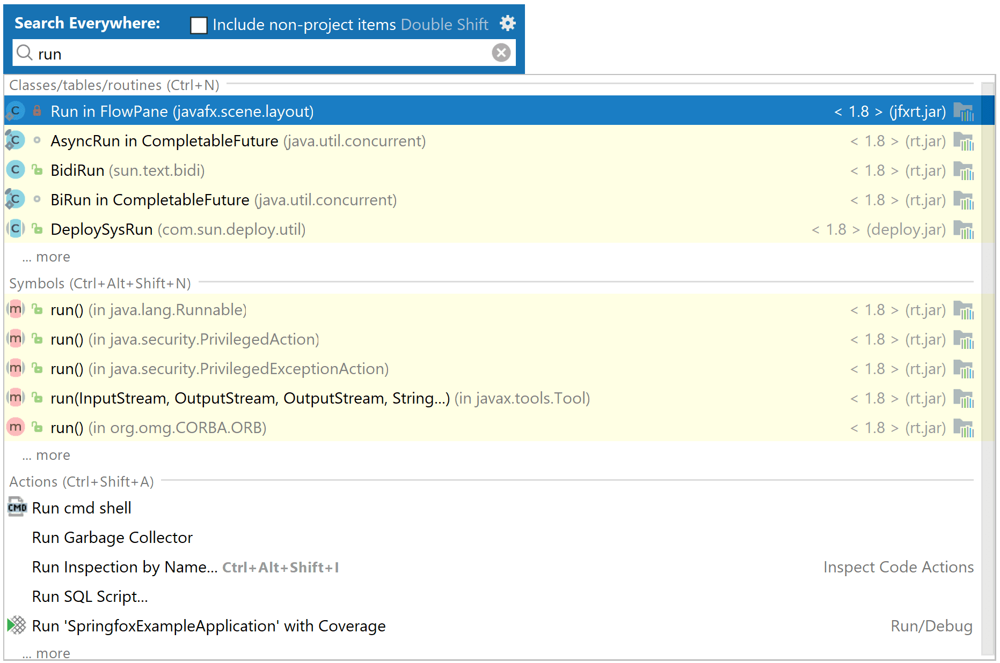

# 如何快速开始使用快捷键

首先明白快捷键的需求，用快捷键做什么，所以使用 [key promoter](https://github.com/athiele/key-promoter-fork) 来统计使用过的菜单，快捷键，找到自己最常使用的快捷键路径。

另外一条路径是通过 <kbd>Ctrl</kbd> + <kbd>Shift</kbd> + <kbd>a</kbd> 来通过名字找到一个可以使用的 action。

当然敲击两下 <kbd>Shift</kbd> 可以触发 Search Everywhere ，不经可以搜索文件也可以搜索 Action

