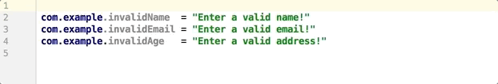
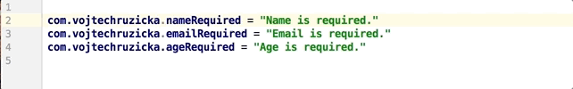
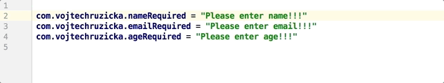

# IntelliJ IDEA Tips & Tricks: 多个光标

Vim 中的列选对于处理多行文本是非常有用的，vim 中的 `.` 重复上一次的操作也是非常常用的动作。而 IntelliJ IDEA 其实也提供了非常方便的多列操作，甚至是跨行多列等等操作，Intellij IDEA 中被叫做 Multiple Cursors.

## Column Selection
列选是最常用的一个功能了，对于需要批量处理多行数据来说，列选的操作非常合适

对于上面的操作如果使用 END 可能会使得光标竖直不对齐

这个功能功能在 `Edit -> Column Selection` 中可以被启用，快捷键自定义。

在列选的模式下，可以完全使用键盘，按住 Shift ，然后可以使用 Up/Down 来扩展光标。

## Caret Cloning

使用 Shift + Up/Down 来创建多个光标的功能，通过 `Clone Caret above` 和 `Clone Caret bellow` 也可以实现。

光标克隆通过按住 Ctrl，然后再按一次并且不松开，在按住 Ctrl 的前提下，使用 Up/Down 来复制光标。

## Multiple Cursors

虽然列选模式非常有用，但是也有其局限，只能垂直对齐的时候使用，但有的时候也需要不对齐的时候用到。

虽然 Keymap 上是 Alt Shift + Click 可以任意增加光标，但是我在 Ubuntu + Cinnamon 环境下尝试失败。

## Advanced selection
选择模式不仅可以适用于插入，还可以适用于选择

还可以选择 Select All Occurrence，虽然默认的快捷键是 Shift Ctrl Alt 我依然没有尝试成功。

## reference

- <https://www.vojtechruzicka.com/intellij-idea-tips-tricks-multiple-cursors>